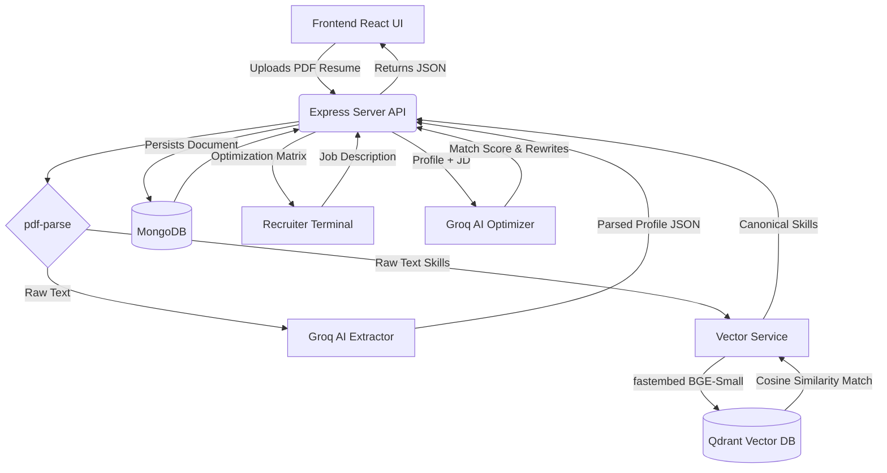

<div align="center">
  
  
  
  
  
</div>

<br />

<div align="center">
  <h1 align="center">🚀 AI-Powered Profile Engine & Data Normalizer</h1>
  <p align="center">
    <strong>Solving the dirty data problem in recruitment tech.</strong>
    <br />
    An enterprise-grade AI SaaS prototype that transforms chaotic, unstructured PDF resumes into perfectly structured, canonical JSON profiles optimized for any Job Description.
  </p>
</div>

<hr />

## 🌐 Live Demo

- **Frontend Application (Vercel):** [https://ai-career-passport.vercel.app](https://ai-career-passport.vercel.app)
- **Backend API (Render):** [https://ai-career-passport.onrender.com/api/health](https://ai-career-passport.onrender.com/api/health)

## ✨ Key Features

- **🧠 RAG Normalization Pipeline**: Uses a local Qdrant Vector Database and `fastembed` to map messy, raw user skills (e.g. "reactjs", "react.js") to an industry-standard canonical taxonomy.
- **🕵️ AI Recruiter Agent**: Powered by LLaMA-3 (via Groq), this agent evaluates parsed experiences and projects against target Job Descriptions, returning intelligent Match Scores and highly optimized, metric-driven resume bullets.
- **📄 Robust Resume Parsing**: Extracts structured personal info, work experience, education, and projects from raw PDF text with near-perfect accuracy using zero-shot prompt engineering.
- **🎨 Glassmorphism Dashboard**: A premium, animated React frontend featuring inline-editing capabilities, AI status tracking, and side-by-side RAG visualizers.
- **📥 PDF Export**: Compiles the newly AI-optimized profile into a clean, ATS-friendly PDF document with selectable themes.

## 📐 Architecture Diagram



## 🛠️ Tech Stack

| Category | Technologies |
| --- | --- |
| **Frontend** | React, Vite, TypeScript, Tailwind CSS, Framer Motion, Lucide React, Axios |
| **Backend** | Node.js, Express, TypeScript, Mongoose, Multer, PDFKit, pdf-parse |
| **AI / ML** | Groq API (LLaMA-3-70B), ONNX Runtime (`fastembed`), RAG Pipeline |
| **Infrastructure** | Vercel (Frontend), Render (Backend via Docker), Qdrant Cloud (Vector DB), MongoDB Atlas |

## 🚀 Getting Started (Local Development)

Follow these instructions to run the full stack locally via Docker and Vite.

### 1. Clone the Repository
```bash
git clone https://github.com/yourusername/ai-career-passport.git
cd ai-career-passport
```

### 2. Environment Setup
Navigate to the `backend` directory and set up your environment variables:
```bash
cd backend
cp .env.example .env
```
Open `.env` and fill in your keys:
- `GROQ_API_KEY`: Get this from your [Groq Console](https://console.groq.com/).
- `MONGODB_URI`: Defaults to `mongodb://localhost:27017/ai-career-passport` if using the local docker-compose setup.

### 3. Start Backend Infrastructure
Ensure Docker Desktop is running, then spin up the backend API, MongoDB, and Qdrant vector database:
```bash
# Still in the /backend directory
npm install
docker compose up --build -d
```
*(Note: Initial setup might take a minute as Docker downloads the necessary MongoDB and Qdrant images).*

### 4. Seed the Vector Database
Once the containers are running, you must seed Qdrant with the canonical skill taxonomy so the RAG pipeline has targets to match against.
```bash
npm run seed:skills
```

### 5. Start the Frontend Dashboard
Open a **new** terminal window, navigate to the frontend directory, and start the Vite dev server:
```bash
cd frontend
npm install
npm run dev
```
Open `http://localhost:5173` in your browser to view the application!

## 🧪 Core Data Flow (The Secret Sauce)

Why go through the trouble of a RAG pipeline just for skills?

In recruitment tech, data consistency is the biggest bottleneck. A candidate might write `"Reactjs"`, `"React.js"`, `"React JS"`, or just `"React"`. Searching a traditional database for these variations requires incredibly complex regex matching.

By utilizing **Retrieval-Augmented Generation (RAG)** via Qdrant, we solve this programmatically:
1. We take a chaotic skill extracted by the LLM (e.g., `"reactjs"`).
2. We embed it locally using `fastembed` into a dense vector space (384 dimensions).
3. We query our pre-seeded Qdrant Vector DB for the closest spatial match.
4. Qdrant returns `"React.js"` (the canonical, industry-standard term).

The resulting MongoDB document contains perfectly clean, normalized data arrays ready for high-performance indexing and algorithmic matching.
